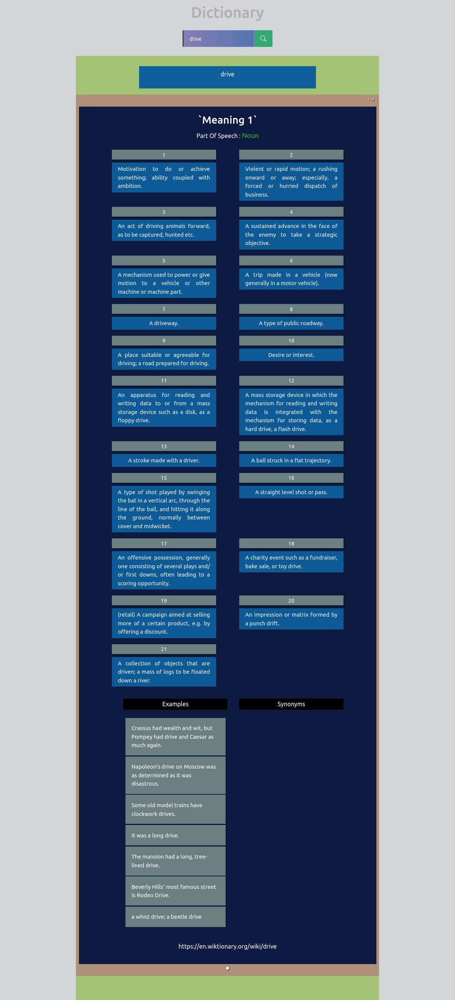
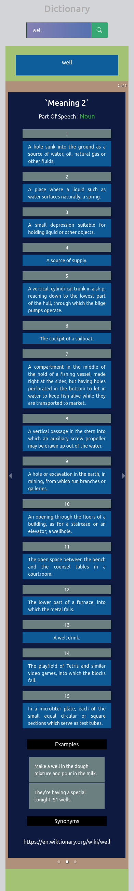

# dictionary app

Sideland : **## words and meanings**

> ### Overview :

- **Say one word!**
- Words simply put are useful to make sense in a sentence. If you will to say something to someone you don't kick spelling letters with you feets but use words coming out from your mouth. It is neccessary and of one a great importance to know about words and their meanings. One fact is because words used casually might cut out the sense given to your thoughts and sentences. When you are a public personnality, a star , and have popularity on one field, you need to be careful about what you say because one word can make you stand as a skillfull or a good person or in reverse like a trash or an evil person . It all depends if you have right used it, and also of the **context** that lead you to bring out what you say or what you have said.

## Interest

You might be interested on how:

- to filter word and re-render DOM using `useEffect Hook` of react

- or use `bootstrap` inside a _react project_

### Links

- Solution URL: [https://github.com/BeinRain06/dictionary-app.git](https://github.com/BeinRain06/dictionary-app.git)
- Live Site URL: [https://beinrain06.github.io/dictionary-app/](https://beinrain06.github.io/dictionary-app/)

## Description : \* challenge issue

**redux reducer actions**

> Redux is particular;y famous when dealing with large scale app that have severals **data** to manage, we were willing to go through this **state management tool** and looks how it works.
>
> **analyzing**

1.  Here is the part we have much had trouble **reducers** in `createSlice`

    > `reducers: {
    > addToCart: (state, action) => {

        const newItem = action.payload;

        const index1 = newItem.id - 1;

        const existingItem = state.myCartProducts.find(
          (item) => item.id === newItem.id
        );

        if (existingItem) {
          existingItem.quantity++;
          existingItem.totalPrice += newItem.price;
          state.productsList[index1].quantity++;
          console.log(existingItem.quantity);
          console.log(existingItem.totalPrice);
        } else {
          state.myCartProducts.push({
            id: newItem.id,
            name: newItem.name,
            price: newItem.price,
            quantity: 1,
            totalPrice: newItem.price,
          });
          state.totalQuantity++;
          state.productsList[index1].quantity = 1;
        }

        state.entireBill = state.myCartProducts.reduce((accumulator, item) => {
          return accumulator + item.totalPrice;
        }, 0);

    },
    }`

    >

- because we need to `understand` really about what is `payload` and how to deal writing functions that could affect state of some variables we declared.
- Here is what we got . **payload** is about what we need to pass to **initialize** or set actions through a given direction.
- For example this syntax of `addToCart` in our cartSlice.js file use **payload** we push first an element to a cart `state.myCartProducts.push(**payload**)`. Here the payload is an **object** variable passed to _myCartsProducts_ array and this direction also move us to set **payload** at the right component **<Product/>** where the the `addToCart`es effectively triggered :
  - `const addToCart = () => {
 dispatch( cartActions.addToCart({ **payload**}));
}` >
- **payload** is all about what you need to achieve a certain action . Payload could be a **number**, an **object**, an **array**, ...

>

2.  with **redux** using **@reduxjs/toolkit** we need two main files:

    - the first to **configure** our storage file `store.js` file.
      >
    - the second to **initialize**, **get** and **set** method to **manages** state change of our app. here that correspond to our `cartSlice.js` file.

>

3.  we have to provide data of our **store** to our entire application (wrap <App/> component located in `index.js` file ) using <Provider>{children}<Provider/> component.

- Here it looks alike:
- `const root = ReactDOM.createRoot(document.getElementById("root"));
root.render(
  <React.StrictMode>
    <Provider store={store}>
      <App />
    </Provider>
  </React.StrictMode>
);`

## CSS Structures:

> two main components in your <App/>:
> -Header.jsx, and Main.jsx

**Picture**

---

---

# What I learned

### Use Bootstrap Classes in React

All we need to do is to install bootstrap and import **minified version** of css and js in the **indexjs** file of our project.
After that we can use and learn about classes of bootstrap in the source website : [https://getbootstrap.com](https://getbootstrap.com)
Like this:

- command(inside our directory project) : npm install bootstrap
- add :
  - import "bootstrap/dist/css/bootstrap.min.css";
  - import "bootstrap/dist/js/bootstrap.bundle.min";
- Use Classes you need searching over the bunch of classes given in the official website _getbootstrap.com_

### utilities Materials:

    -bootstrap and bootstrap icons

### Mobile Responsiveness

    - Mobile reponsiveness for mobile min-width: 210px

**Picture**

---

---

## Callback History:

- Language allows us to share our thoughts, ideas, emotions, and intenion with others. Over thousands of years , humans have developed a wide variety of system o assign specific meaning to sounds, forming words and systems of gramma tocreate **languages**. Many languages developed written forms using symbols to visully record their meaning. Some languages lik American Sign Language (ASL), are an entirely visual laguage without the need for vocalizations.
- Although Languages are defined by rules, heir are by no means static, and evolve over time. Some languages are incredibly old and have changed ve little over time. Others languages evolve rapidly by incorporating **elements of others languages**
- Still other languages die out due to political oppression or social assimilaion, though many dying languages **live on** in the vocabularies and dialects of prominent languages around the world.

src: _National Geography Education_
[https://education.nationalgeographic.org/rsource/evolution-langauge/](https://education.nationalgeographic.org/rsource/evolution-langauge/)

## Useful Resources :

- web Dev Simplified: [https://www.youtube.com/watch?v=s1XVfm5mIuU](https://www.youtube.com/watch?v=s1XVfm5mIuU) : quick reminding explanation on how to use `reduce` **method** of javasript when having array of object variables and need to access specificly a **particular** property inside;

  >

- Colt Steele: [https://www.youtube.com/watch?v=VOQSrdX82L8](https://www.youtube.com/watch?v=VOQSrdX82L8) : in a way similar the prevous video, lead me to know about others uses of `reduce` **method** of javascript inside a project.

  >

- freeCodeCamp.org: [https://www.youtube.com/watch?v=zrs7u6bdbUw&t=1566s](https://www.youtube.com/watch?v=zrs7u6bdbUw&t=1566s) : simply put this one was my guidelines and inspiration to how **manages** state in `react-redux` using **@reduxjs/toolkit** and it works fine. thanks you to **nikhil-thadani** of **freeCodeCamp** . Also it has a given repository under: [Nikhilthadani /
  Redux-Shopping-Cart-App](https://github.com/Nikhilthadani/Redux-Shopping-Cart-App)

## Acknowledge:

This project always remember the Team :

- **Sufa Digital**: udemy with his enlightment about the feature to achieve this project
  >
- **nikhil-thadani** : with his help with a realistic project how manage state with **redux** in react
  >
- **Kyle[web dev Simpliflied]** and also **Colt Sttele** that give us a brief and concise explanation about javascript **reduce** method.

_Our Work always remember this team_

## Author

- Frontend Mentor - [https://www.frontendmentor.io/profile/BeinRain06](https://www.frontendmentor.io/profile/BeinRain06)
- Twitter - [https://twitter.com/nest_Ngoueni](https://twitter.com/nest_Ngoueni)
